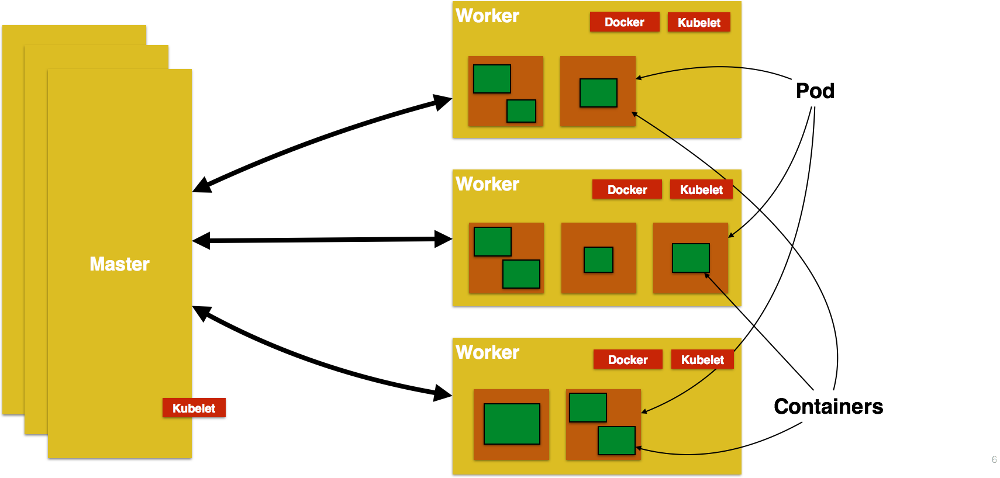

= Kubernetes Refcardz
:toc:
:toc-placement!:

toc::[]

Kubernetes (http://kubernetes.io) is an open source orchestration system for managing containerized applications across multiple hosts, providing basic mechanisms for deployment, maintenance, and scaling of applications.

Kubernetes, or "`k8s`" in short, allows the user to provide declarative primitives for the desired state, for example “need 3 Couchbase servers running”. Kubernetes self-healing mechanisms, such as auto-restarting, re-scheduling, and replicating containers then ensure that this state is met.

Kubernetes supports Docker and Rocket containers, and other container image formats and container runtimes will be supported in the future.

== Key Concepts

=== Cluster

A Kubernetes cluster is a set of physical or virtual machines and other infrastructure resources that are used running your applications. The machines that manage the cluster are called _Master_ and the machines that run the containers are called _Worker_.

=== Master Node

A master is the central control point that provides a unified view of the cluster. Multiple masters can be setup to create a high-availability cluster.

=== Worker Node

 A node is worker node that run tasks as delegated by the master. Node can run one or more pods.

=== Pod

A Pod is the smallest deployable units that can be created, scheduled, and managed. Its a logical collection of containers that belong to an application.

Each resource in Kubernetes is defined using a configuration file. For example, a Couchbase pod can be defined as:

[source, text]
----
apiVersion: v1
kind: Pod
# labels attached to this Pod
metadata:
  name: couchbase-pod
spec:
  containers:
  - name: couchbase
    # Docker image that will run in this Pod
    image: couchbase
    ports:
    - containerPort: 8091
----

=== Kubelet

Each node, master or worker, runs a service that allows to run containers and be managed from the master. It reads container manifests as YAML or JSON files that describes a Pod. A typical way to provide this manifest is using the configuration file as shown in previous section. Kubelet ensures that the containers defined in the pods are started and continue running.

Kubelet is a Kubernetes-internal concept and generally does not require direct manipulation. 

An overview of Kubernetes showing the key components is shown:

=== Label

A label is a key/value pair that is attached to objects, such as pods. Multiple labels can be attached to a resource. Labels can be used to organize and to select subsets of objects. In the previous example

=== Replication Controller

A replication controller ensures that a specified number of pod replicas are running on worker nodes at all times. It allows both up- and down-scaling the number of replicas. It also ensures recreation of pod when the worker node reboots or otherwise fails.

A Replication Controller creating two instances of a Couchbase pod can be defined as:

[source, text]
----
apiVersion: v1
kind: ReplicationController
metadata:
  name: couchbase-controller
spec:
  # Two replicas of the Pod to be created
  replicas: 2
  # Identifies the label key and value on the Pod that
  # this Replication Controller is responsible for managing
  selector:
    app: couchbase-rc-pod
  # 'cookie cutter' used for creating new pods when necessary
  template:
    metadata:
      labels:
        # label key and value on the pod. These must match the selector above.
        app: couchbase-rc-pod
    spec:
      containers:
      - name: couchbase
        image: couchbase
        ports:
        - containerPort: 8091
----

=== Service

Each Pod is assigned a unique IP address. If the Pod is inside a Replication Controller then it is recreated but may be given a different IP address. This makes it difficult for an application server, such as WildFly, to access a database, such as Couchbase, using its IP address.

A Service defines a logical set of Pods and a policy by which to access them. IP address assigned to a Service does not change over time, and thus can be relied upon by other Pods. Typically the Pods belonging to a Service are defined by a Label Selector.

For example, a Couchbase service might be defined as:

[source, text]
----
apiVersion: v1
kind: Service
metadata: 
  name: couchbase-service
  labels: 
    app: couchbase-service-pod
spec: 
  ports:
    - port: 8091
  # label keys and values of the Pod started elsewhere
  selector: 
    app: couchbase-rc-pod
----

Note that the labels used in `selector` must match the metadata used for creating the Pod by the Replication Controller.

=== Volumes

A Volume is a directory on disk or in another container. A volume outlives any containers that run within the Pod, and data is preserved across Container restarts. The directory, the medium that backs it, and the contents of it are determined by the particular volume type used.

Multiple types of volumes are supported. Some of the commonly used volume types are shown below:

[options="header"]
|====
| Volume Type | Mounts into your pod
| `hostPath` | A file or directory from the host node's filesystem
| `nfs` | Existing Network File System share
| `awsElasticBlockStore` | An Amazon Web Service EBS Volume
| `gcePersistentDisk` | A Google Compute Engine Persistent Disk
|====

A Volume is specified in the Pod configuration file as shown:

[source, text]
----
apiVersion: v1
kind: ReplicationController
metadata:
  name: couchbase-controller
spec:
  replicas: 1
  # In-line template of the Pod
  template:
    metadata:
      app: couchbase-rc-pod
    spec:
      containers:
        - name: couchbase-rc-pod
          image: arungupta/couchbase
          ports:
          - containerPort: 8091
          volumeMounts:
          # name must match the volume name below
          - name: nfs
            mountPath: /usr/share/couchbase
      volumes:
        - name: nfs
          persistentVolumeClaim:
            claimName: nfs
----

This configuration file also shows that Pod template can be specified inline.

== Getting Started with Kubernetes

=== Kubectl CLI

`kubectl` is a command-line utility that controls the Kubernetes cluster. This utility can be used in the following format:

`kubectl [command] [type] [name] [flags]`

- `[command]` specifies the operation that needs to be performed on the resource. For example, `create`, `describe`, `delete`, or `scale`.
- `[type]` specifies the Kubernetes resource type. For example, `pod`, `service`, `replicationcontroller`, or `node`. Resource types are case-sensitive and you can specify the singular, plural, or abbreviated forms.
- `[name]` Specifies the name of the resource. Names are case-sensitive. If the name is omitted, details for all resources are displayed, for example `kubectl get pods`	.

Some examples of `kubectl` commands and their purpose:

[options="header"]
|====
| Command | Purpose
| `kubectl create -f couchbase-pod.yml` | Create a Couchbase pod
| `kubectl create -f couchbase-rc.yml` | Create a Couchbase Replication Controller
| `kubectl get pods` | List all the pods
| `kubectl describe pod couchbase-pod` | Describe the Couchbase pod
|====

=== Start the Cluster

Several options are available but the most common ones are Vagrant, Amazon Web Service (AWS) and Google Compute Engine (GCE).

==== Start the Cluster using Vagrant

==== Start the Cluster using AWS

==== Start the Cluster using GCE

== Run your first Container

== Scale Applications

== Connecting Containers using Service

== Volumes

== Health Check

== Debugging

== About the Author

Arun Gupta is the vice president of developer advocacy at Couchbase. He has been building developer communities for 10+ years at Sun, Oracle, and Red Hat. He has deep expertise in leading cross-functional teams to develop and execute strategy, planning and execution of content, marketing campaigns, and programs. Prior to that he led engineering teams at Sun and is a founding member of the Java EE team.

Gupta has authored more than 2,000 blog posts on technology. He has extensive speaking experience in more than 40 countries on myriad topics and is a JavaOne Rock Star. Gupta also founded the Devoxx4Kids chapter in the US and continues to promote technology education among children. An author of a best-selling book, an avid runner, a globe trotter, a Java Champion, and a JUG leader, he is easily accessible at @arungupta.
