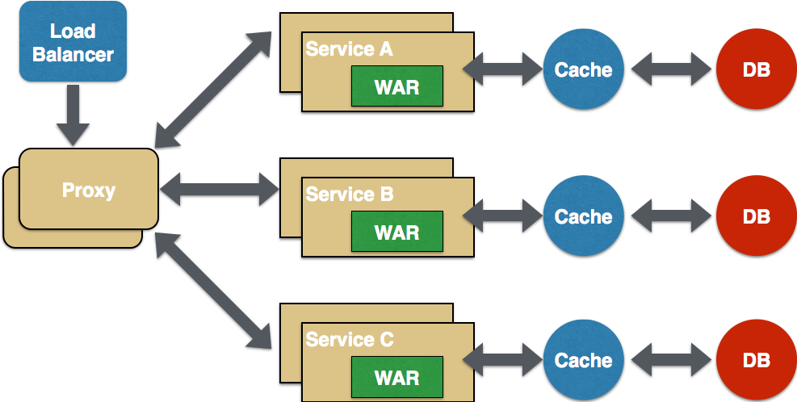
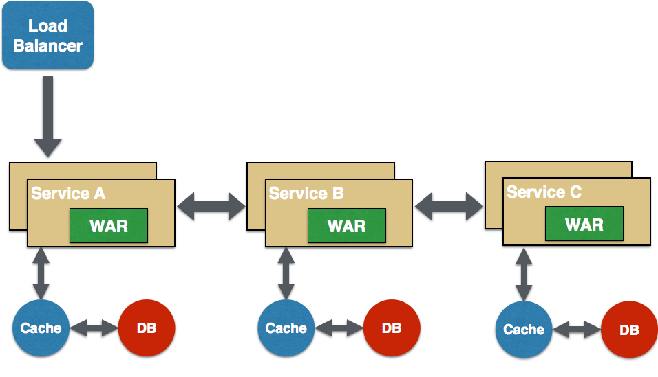
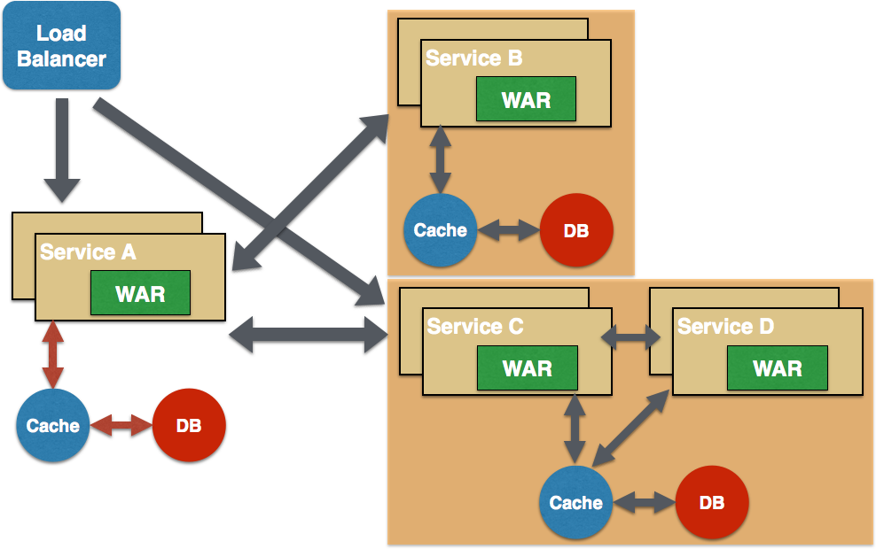
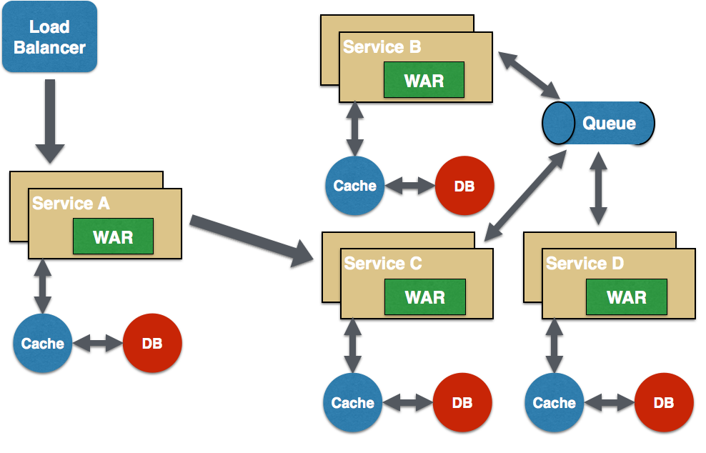

= Microservices Refcardz
:toc:
:toc-placement!:

toc::[]

The term "microservices" describes a new software development pattern that has grown from recent trends in software development/management practices meant to increase the speed and efficiency of developing and managing software solutions. Agile methods, DevOps culture, PaaS, application containers, and the widespread adoption (both culturally and technically) of CI/CD methods across the marketplace are making it possible to consider building truly modular large-scale service systems for both internal and commercial use.

== What Are Microservices?

Microservices involve an _architectural approach_ that emphasizes the _decomposition of applications_ into _single-purpose_, _loosely coupled services_ managed by _cross-functional teams_, for delivering and maintaining _complex software systems_ with the velocity and quality required by today’s digital business.

Microservices are language-, platform-, and operating system-agnostic. They break down a big monolithic application, typically packaged as a single archive, into smaller and simpler applications. Each application does one thing, and does it well, so the "`micro`" in microservices refers to the scope of the services' functionalities, as opposed to the number of Lines of Code (LOC).

Each application is built by a full-stack team, which reduces potential communication mismatch between different teams that could exist otherwise. Microservices may not be suitable for simpler applications and are better suited for complex applications that have grown over a period of time.

The availability of an application on a mobile device; the frequency with which an application needs to be updated; and the responsiveness of an application's design are a few key factors driving this style of architecture.

The concept behind microservices is similar to Service-oriented Architecture (SOA), which is why this style of architecture has been referred to as "`SOA with DevOps,`" "`SOA for hipsters,`" and "`SOA 2.0`".

== Key Characteristics of Microservices

. *Domain-Driven Design*: Functional decomposition can be easily achieved using Eric Evans's DDD approach.
. *Single Responsibility Principle*: Each service is responsible for a single part of the functionality, and does it well.
. *Explicitly Published Interface*: A _producer_ service publishes an interface that is used by a _consumer_ service.
. *Independent DURS (Deploy, Update, Replace, Scale)*: Each service can be independently deployed, updated, replaced, and scaled.
. *Lightweight communication*: REST over HTTP, STOMP over WebSocket, and other similar lightweight protocols are used for communication between services.

== Benefits of Microservices

. *Independent scaling*: Each microservice can scale independently via X-axis scaling (cloning with more CPU or memory) and Z-axis scaling (sharding), based upon their needs. This is very different from monolithic applications, which may have very different requirements that must be deployed together.
. *Independent upgrades*: Each service can be deployed independent of other services. Any change local to a service can be easily made by a developer without requiring coordination with other teams. For example, performance of a service can be improved by changing the underlying implementation. As a result this maintains the agility of the microservice. This is also a great enabler of CI/CD.
. *Easy maintenance*: Code in a microservice is restricted to one function and is thus easier to understand. IDEs can load the smaller amounts of code more easily, and increased readability can keep developers more productive.
. *Potential heterogeneity and polyglotism*: Developers are free to pick the language and stack that are best suited for their service. This enables one to rewrite the service using better languages and technologies as opposed to being penalized because of past decisions, and gives freedom of choice when picking a technology, tool, or framework.
. *Fault and resource isolation*: A misbehaving service, such as a memory leak or an unclosed database connection, will only affect that service, as opposed to an entire monolithic application. This improves fault isolation and limits how much of an application a failure can affect.
. *Improved communication across teams*: A microservice is typically built by a full-stack team. All members related to a domain work together in a single team, which significantly improves communication between team members, as they share the same end goal.

== Operational Requirements for Microservices

Microservices are not the silver bullet that will solve all architectural problems in your applications. Implementing microservices may help, but that is often just the byproduct of refactoring your application and typically rewriting code using guidelines required by this architecture style. True success requires significant investment.

. *Service Replication*: Each service needs to replicate, typically using X-axis cloning or Y-axis partitioning. There should be a standard mechanism by which services can easily scale based upon metadata. A PaaS, such as OpenShift by Red Hat, can simplify this functionality.
. *Service Discovery*: In a microservice world, multiple services are typically distributed in a PaaS environment. Immutable infrastructure is provided by containers or immutable VM images. Services may scale up and down based upon certain pre-defined metrics. The exact address of a service may not be known until the service is deployed and ready to be used.
+
The dynamic nature of a service's endpoint address is handled by service registration and discovery. Each service registers with a broker and provides more details about itself (including the endpoint address). Other consumer services then query the broker to find out the location of a service and invoke it. There are several ways to register and query services such as ZooKeeper, etcd, consul, Kubernetes, Netflix Eureka, and others.
. *Service Monitoring*:  One of the most important aspects of a distributed system is service monitoring and logging. This enables one to take proactive action if, for example, a service is consuming unexpected resources. The ELK Stack can aggregate logs from different microservices, provide a consistent visualization over them, and make that data available to business users. Other possible tools for distributed logging are Syslog, Logentries, and Loggly.
. *Resiliency*: Software failure will occur, no matter how much and how hard you test. This is all the more important when multiple microservices are distributed all over the Internet. The key concern is not "`how to avoid failure`" but "`how to deal with failure.`" It's important for services to automatically take corrective action to ensure user experience is not impacted. The Circuit Breaker pattern allows one to build resiliency in software--Netflix's Hystrix and Ribbon are good libraries that implement this pattern.
. *DevOps*: Continuous Integration and Continuous Deployment (CI/CD) are very important in order for microservices-based applications to succeed. These practices are required so that errors are identified early, and so little to no coordination is required between different teams building different microservices.

== Good Design Principles for Existing Monoliths

Refactoring a monolith into a microservices-based application will not help solve all architectural issues. Before you start breaking up a monolith, it's important to make sure the monolith is designed following good software architecture principles. Some common rules are:

. Practice separation of concerns, possibly using Model-View-Controller (MVC)
. Use well-defined APIs for high cohesion and low coupling
. Don’t Repeat Yourself (DRY)
. Use Convention over Configuration (CoC)
. Separate interfaces/APIs and implementations, and follow the Law of Demeter. Classes shouldn’t call other classes directly just because they happen to be in the same archive
. Use Domain-Driven Design to keep objects related to a domain/component together
. Don’t build something that you don’t need now (YAGNI--You Aren’t Going to Need It)

== Refactoring a Monolith to Microservices

Consider a Java EE monolithic application that is typically defined as a WAR or an EAR archive. The entire functionality for the application is packaged in a single unit. For example, an online shopping cart may consist of User, Catalog, and Order functionalities. All web pages are in the root of the application, all corresponding Java classes are in the `WEB-INF/classes` directory, and all resources are in the `WEB-INF/classes/META-INF` directory.

image::monolith.png[]

Such an application can be refactored into microservices, which would create an architecture that would look like the following:

image::refactor-microservices.png[]

. The above application is functionally decomposed where User, Order, and Catalog components are packaged as separate WAR files. Each WAR file has the relevant web pages, classes, and configuration files required for that component.
. Java EE is used to implement each component, but there is no long-term commitment to the stack, as different components talk to each other using a well-defined API.
. Different classes in this component belong to the same domain, so the code is easier to write and maintain. The underlying stack can also change, possibly keeping technical debt to a minimum.
. Each archive has its own database (i.e. data stores are not shared). This allows each microservice to evolve and choose whatever type of data store–relational, NoSQL, flat file, in-memory, or some thing else–is most appropriate.
. Each component registers with a Service Registry. This is required because multiple stateless instances of each service might be running at a given time, and their exact endpoint locations will be known only at the runtime. Netflix Eureka, etcd, and Zookeeper are some options for service registry/discovery.
. If components need to talk to each other, which is quite common, then they would do so using a pre-defined API. REST for synchronous or Pub/Sub for asynchronous communication are the most common means to achieve this. In this case, the Order component discovers User and Catalog service and talks to them using a REST API.
. Client interaction for the application is defined in another application (in this case, the Shopping Cart UI). This application discovers the services from the Service Registry and composes them together. It should mostly be a dumb proxy (discussed in a later section), where the UI pages of the different components are invoked to display the interface. A common look and feel can be achieved by providing standard CSS/JavaScript resources.

More details can be found at: http://github.com/arun-gupta/microservices.

== Microservices Design Pattern

Multiple microservices can be composed with each other to provide composite microservices. Some common design patterns are explained below.

=== Aggregator

Results from multiple microservices are aggregated into one composite microservice.

In its simplest form, an Aggregator would be a simple web page that invokes multiple services to achieve the functionality required by the application. Since each service (Service A, Service B, and Service C) is exposed using a lightweight REST mechanism, the web page can retrieve the data and process/display it accordingly. If processing is required--for example, if you need to apply business logic to the data received from individual services--then you will likely need a bean to transform the data before being displayed by the Aggregator web page.

An Aggregator can also act simply as a higher-level composite microservice which can be consumed by other services. In this case, the Aggregator would collect the data from each individual microservice, apply business logic to it, and publish it as a REST endpoint.

This design pattern follows the DRY principle--if there are multiple services that need to access Service A, B, and C, then you should abstract that logic into a composite microservice and aggregate that logic into one service. An advantage of abstracting at this level is that the individual services (i.e. Service A, B, and C) can evolve independently, and the needs of the business logic are still provided by the composite microservice.

=== Proxy

The Proxy microservice design pattern is a variation of the Aggregator. In this case, aggregation does not need to happen client-side. Rather, a different microservice may be invoked as required by the business logic.

Just like in the Aggregator pattern, a Proxy can scale independently on the X-axis and Z-axis. You may want to do this in cases where each individual service does not need to be exposed to the consumer and should instead go through an interface.

A Proxy can be classified in one of two ways. A _dumb proxy_ just delegates any request to one of the services. Alternatively,  a _smart proxy_ applies some data transformation before the response is served to the client. A good example of this would be where the presentation layer to different devices can be encapsulated in the smart proxy.

=== Chained

The Chained microservice design pattern produces a single consolidated response to a request. In this case, the request from the client is received by Service A, which then communicates with Service B, which in turn may communicate with Service C. All of these services are likely using a synchronous HTTP request/response messaging.

One important thing to understand here is that the client is blocked until the complete chain of request/response (i.e. *Service A <-> Service B* and *Service B <-> Service C*), is completed. The request from Service B to Service C may look completely different from the request from Service A to Service B. Similarly, response from Service B to Service A may look completely different from Service C to Service B. And that’s the whole point; different services are adding their own value.

This means it's important to remember not to make the chain too long because the synchronous nature of the chain will appear like a long wait at the client side--especially if it's a web page that is waiting for the response to be shown. There are workarounds to the blocking caused by this request/response, which are discussed in a subsequent design pattern.

*Note:* A chain with a single microservice is called _singleton chain_.

=== Branch

The Branch microservice design pattern extends the Aggregator design pattern and allows simultaneous response processing from two (likely mutually exclusive) chains of microservices. This pattern can also be used to call different chains, or a single chain, based upon the business logic needs.

image::microservices-branch-pattern.png[]

Service A--either a web page or a composite microservice--may invoke two different chains concurrently, resembling the Aggregator design pattern. Alternatively, Service A may invoke only one chain, based on the request received from the client.

=== Shared Resources

One of the design principles behind microservices is autonomy. This means the service is full-stack and has control of all the components—UI, middleware, persistence, transactions. This allows the service to be polyglot, so the right tool can be used for the right job. For example, if your application uses some data that fits naturally in a graph store, while other data fits naturally in a relational database, you can use the appropriate storage model for each domain, rather than jamming everything into a SQL or NoSQL database.

However, a typical problem (especially when refactoring from an existing monolithic application) is database normalization: ensuring that each microservice has the right amount of data--nothing less and nothing more. Even if only a SQL database is used in a monolithic application, denormalizing the database would lead to duplication of data, and possibly inconsistency. In a transition phase, some applications may benefit from a shared data microservice design pattern.

Some microservices, likely in a chain, may share caching and database stores. This only makes sense if there is a strong coupling between the two services. Some people might consider this an anti-pattern, but business logic needs might require it in some cases. This would certainly be an anti-pattern for greenfield applications implementing a microservices design pattern.

=== Async Messaging

While the REST design pattern is quite prevalent, and well understood, it has the limitation of being synchronous, and thus blocking. Asynchrony can be achieved, but must be done in an application-specific way. Because of this, some microservice architectures may elect to use message queues instead of REST request/response.

In the preceding design pattern, Service A may call Service C synchronously, while Service C is communicating with Service B and D asynchronously using a shared message queue. Service A -> Service C communication could also be asynchronous, possibly using WebSocket, to achieve the desired scalability.

A combination of REST request/response and pub/sub messaging may be used to accomplish the business logic need.

== Conclusion

The Microservices model has well-known advantages and can certainly help your business evolve faster. But monoliths have served us well so far, and will continue to work for years to come. Consider the operational requirements of microservices in addition to the benefits before considering refactoring your monolith to a microservices architecture. Many times, better software engineering and architecture will be enough. But if you decide to follow the microservice route, then the advice in this Refcard should help to get you started.

== About the Author

Arun Gupta is Director of Developer Advocacy at Red Hat, focusing on Red Hat JBoss Middleware. As a founding member of the Java EE team at Sun Microsystems, he spread the love for technology all around the world. At Oracle, he led a cross-functional team to drive the global launch of the Java EE 7 platform, including strategic planning and execution, content development, and the execution of marketing campaigns and programs. After authoring ~1,400 blogs at blogs.oracle.com/arungupta on different Java technologies, he continues topromote Red Hat technologies and products at blog.arungupta.me.
