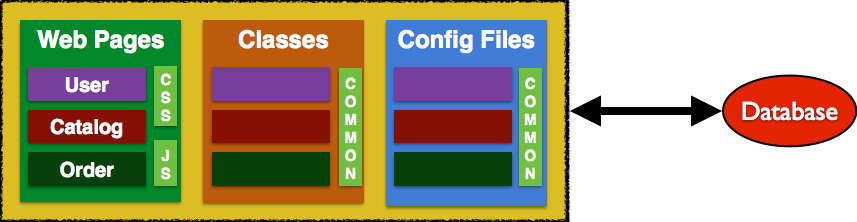
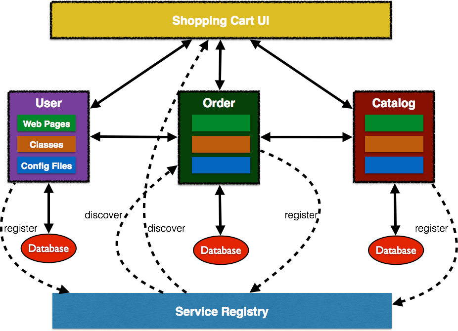
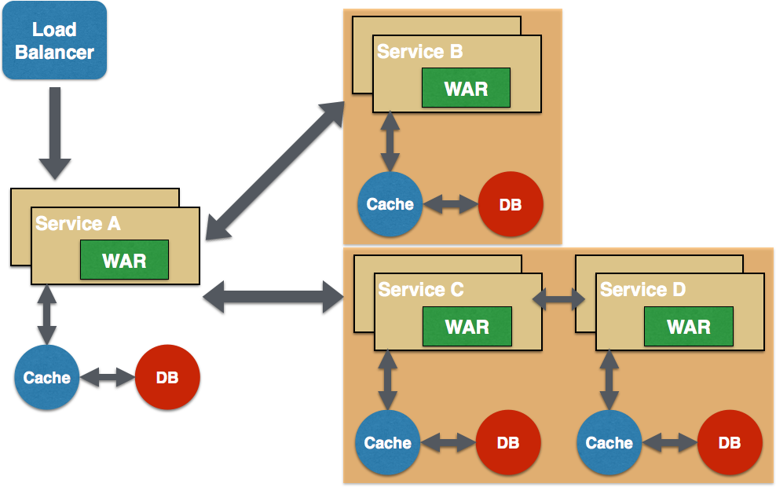

= Microservices Refcardz
:toc:
:toc-placement!:

toc::[]

Microservices are a new software development  pattern which has grown out of the recent trends in software development and software management practices to increase the speed and efficiency of developing and managing software solutions . Agile methods, DevOps culture, PaaS, application containers and the widespread adoption (both mentally and technically) of CI/CD methods across the marketplace are making it possible to consider building truly modular large scale service systems for both internal and commercial use.

== What are microservices?

Microservices is an _architectural approach_, that emphasizes the _decomposition of applications_ into _single-purpose_, _loosely coupled services_ managed by _cross-functional teams_, for delivering and maintaining _complex software systems_ with the velocity and quality required by _today’s digital business_.

Microservices is language, platform, and operating system agnostic. It breaks down a big monolithic application, typically packaged as a single archive, in to smaller and simpler applications. Each application does one thing, and does it well. The "`micro`" in microservices refers to this scope as opposed to the Lines of Code (LOC).

Each application is built by a full-stack team, and this reduces the impedance mismatch between different teams that may exist otherwise. Microservices may not be suitable for simpler applications and is more suited for complex applications which have grown over a period of time.

Availability of your application on a mobile device, frequent updates, and responsive design are key factors driving this style of architecture.

The concept is very similar to SOA and so some other common names for this style of architecture are "`SOA with DevOps`", "`SOA for hipsters`", and "`SOA 2.0`".

== Key characteristics of microservices

. *Domain Driven Design*: Functional decomposition can be easily achieved using Eric Evans DDD.
. *Single Responsibility Principle*: Each service is responsible for a single part of the functionality, and does it well.
. *Explicitly Published Interface*: A _producer_ service publishes an interface that is used by a _consumer_ service.
. *Independent DURS (Deploy, Update, Replace, Scale)*: Each service can be independently deployed, updated, replaced, and scaled.
. *Potentially heterogeneous and polyglot*: Allows to choose the right language, framework, and data store for the service.
. *Lightweight communication*: REST over HTTP, STOMP over WebSocket and other similar lightweight protocols are used for communication between services.

== Benefits of microservices

. *Independently scale*: Each microservice can scale independently using X-axis (cloning with more CPU or memory) and Z-axis (sharding) based upon their need. This is very different from monolithic applications that may have very different requirements and yet must be deployed together.
. *Independently upgrade*: Each service can be deployed independent of other services. Any change local to the service can be easily made by the developer without requiring coordination with other teams. For example, performance of a service can be improved by changing the underlying implementation. As a result this keeps the agility of the microservice. This is also a great enabler of CI/CD.
. *Easy maintenance*: Code in a microservice is restricted to one function of the business and is thus easier to understand. IDEs can load the small code very easily and keep the developers productive.
. *Potentially heterogenous and polyglot*: Developers are free to pick the language and stack that is best suited for their service. It enables to rewrite the service using better languages and technologies as opposed to be penalized because of past decisions. This gives freedom of choice to pick a technology, tools, and frameworks.
. *Fault and resource isolation*: A misbehaving service, such as with a memory leak or unclosed database connections, will only affect that service as opposed to the entire monolithic application. This improves fault isolation and does not bring the entire application down, just a piece of it.
. *Difficult communication across teams*: A microservice is typically built by a full-stack team. Thus all members related to a domain are working together in a single team. This significantly improves communication between team members as they share the same end goal.

== Operational Requirements for Microservices

Microservices is not a silver bullet to solve architectural problems in your applications. It may help but that is often because of refactoring your application, and typically because of rewriting the code using guidelines required by this architecture style. It requires significant investment to be successful.

. *Service Replication*: Each service needs to replicate, typically using X-axis cloning or Y-axis partitioning. There should be a standard mechanism by which services can easily scale based upon metadata. A PaaS, such as OpenShift by Red Hat, can simplify this functionality.
. *Service Discovery*: In a microservice world, multiple services are typically distributed in a PaaS environment. Immutable infrastructure is provided by containers or immutable VM images. Services may scale up and down based upon certain pre-defined metrics. Exact address of the service may not be known until the service is deployed and ready to be used.
+
The dynamic nature of service endpoint address is handled by service registration and discovery. Each service registers with a broker and provides more details about itself, such as the endpoint address. Other consumer services then query the broker to find out the location of a service and invoke it. There are several ways to register and query services such as ZooKeeper, etcd, consul, Kubernetes, Netflix Eureka and others.
. *Service Monitoring*:  One of the most important aspects of a distributed system is service monitoring and logging. This allows to take a proactive action, for example, if a service is consuming unexpected resources. ELK Stack allows to aggregate logs from different microservices, provide a consistent visualization over them, and make that data available to business users. Some other tools for distributed logging are syslog, logentries, and loggly.
. *Resiliency*: Failure in software occurs, no matter how much and how hard you test it. This is all the more important when multiple microservices are distributed all over the Internet. The key question is not "`how to avoid failure`" but "`how to deal with it`". It's important for services to automatically take corrective action and ensure the user experience is not impacted. Circuit Breaker pattern allows to build resiliency in software. Netflix's Hystrix and Ribbon are good libraries that implement this pattern.
. *DevOps*: Continuous Integration and Continuous Deployment (CI/CD) are very important in order for microservices-based applications to succeed. This is required so errors are identified at an early stage and little to no coordination is required between different teams building different microservices.

== Good design principles for monolith

Refactoring a monolith into a microservices-based application will not help solve the architectural issues. It's important for the monolith to be designed following good software architecture principles. Some of the common rules are:

. Separation of concerns, possibly using Model-View-Controller
. High cohesion and low coupling using well-defined APIs
. Don’t Repeat Yourself (DRY)
. Convention over Configuration (CoC)
. Interfaces/APIs and implementations are separate, and following Law of Demeter. Classes don’t call other classes directly because they happen to be in the same archive
. Using Domain Driven Design to keep objects related to a domain/component together
. YAGNI or You Aren’t Going to Need It. Don’t build something that you don’t need now

== Refactoring monolith to microservices

Consider a Java EE monolithic application that is typically defined as a WAR or an EAR archive. The entire functionality for the application is packaged in a single unit. For example, an online shopping cart may consist of User, Catalog, and Order functionalities. All web pages are in root of the application, all corresponding Java classes are in the `WEB-INF/classes` directory, resources in `WEB-INF/classes/META-INF` directory.

Such an application can be refactored into microservices and the updated architecture is shown.

. Application is functionally decomposed where User, Order, and Catalog components are packaged as separate WAR files. Each WAR file has the relevant web pages, classes, and configuration files required for that component.
. Java EE is used to implement each component but there is no long term commitment to the stack as different components talk to each other using a well-defined API.
. Different classes in this component belong to the same domain so the code is easier to write and maintain. The underlying stack can also change, possibly keeping technical debt to a minimum.
. Each archive has its own database, i.e. no sharing of data stores. This allows each microservice to evolve and choose whatever type of datastore – relational, NoSQL, flat file, in-memory or some thing else – is most appropriate.
. Each component will register with a Service Registry. This is required because multiple stateless instances of each service might be running at a given time and their exact endpoint location will be known only at the runtime. Netflix Eureka, Etcd, Zookeeper are some options in this space.
. If components need to talk to each other, which is quite common, then they would do so using a pre-defined API. REST for synchronous or Pub/Sub for asynchronous communication are the common means to achieve this. In this case, Order component discovers User and Catalog service and talks to them using REST API.
. Client interaction for the application is defined in another application, Shopping Cart UI in this case. This application discover the services from Service Registry and compose them together. It should mostly be a dumb proxy where the UI pages of different components are invoked to show the interface. A common look-and-feel can be achieved by providing standard CSS/JavaScript resources.

More details can be found at: http://github.com/arun-gupta/microservices.

== Microservices design pattern

Multiple microservices may be composed with each other to provide composite microservices. Some common design patterns are explained below.

=== Aggregator

Results from multiple microservices are aggregated into one composite microservice.

In its simplest form, Aggregator would be a simple web page that invokes multiple services to achieve the functionality required by the application. Since each service (Service A, Service B, and Service C) is exposed using a lightweight REST mechanism, the web page can retrieve the data and process/display it accordingly. If processing is required, for example applying business logic to the data received from individual services, then you may likely have a bean that would transform the data so that it can be displayed by the web page.

image::microservices-aggregator-pattern.png[]

Another option for Aggregator is where no display is required, and instead it is just a higher level composite microservice which can be consumed by other services. In this case, the aggregator would just collect the data from each individual microservice, apply business logic to it, and further publish it as a REST endpoint. This can then be consumed by other services that need it.

This design pattern follows the DRY principle. If there are multiple services that need to access Service A, B, and C, then it's recommended to abstract that logic into a composite microservice and aggregate that logic into one service. An advantage of abstracting at this level is that the individual services, i.e. Service A, B, and C, and can evolve independently and the business need is still provided by the composite microservice.

=== Proxy

Proxy microservice design pattern is a variation of Aggregator. In this case, no aggregation needs to happen on the client but a different microservice may be invoked based upon the business need.

image::microservices-proxy-pattern.png[]

Just like Aggregator, Proxy can scale independently on X-axis and Z-axis as well. You may like to do this where each individual service need not be exposed to the consumer and should instead go through an interface.

The proxy may be a _dumb proxy_ in which case it just delegates the request to one of the services. Alternatively, it may be a _smart proxy_ where some data transformation is applied before the response is served to the client. A good example of this would be where the presentation layer to different devices can be encapsulated in the smart proxy.

=== Chained

Chained microservice design pattern produces a single consolidated response to the request. In this case, the request from the client is received by Service A, which is then communicating with Service B, which in turn may be communicating with Service C. All the services are likely using a synchronous HTTP request/response messaging.

image::microservices-chained-pattern.png[]

The key part to remember is that the client is blocked until the complete chain of request/response, i.e. Service <-> Service B and Service B <-> Service C, is completed. The request from Service B to Service C may look completely different as the request from Service A to Service B. Similarly, response from Service B to Service A may look completely different from Service C to Service B. And that’s the whole point anyway where different services are adding their business value.

Another important aspect to understand here is to not make the chain too long. This is important because the synchronous nature of the chain will appear like a long wait at the client side, especially if it's a web page that is waiting for the response to be shown. There are workarounds to this blocking request/response and are discussed in a subsequent design pattern.

A chain with a single microservice is called _singleton chain_.

=== Branch

Branch microservice design pattern extends Aggregator design pattern and allows simultaneous response processing from two, likely mutually exclusive, chains of microservices. This pattern can also be used to call different chains, or a single chain, based upon the business needs.

Service A, either a web page or a composite microservice, can invoke two different chains concurrently in which case this will resemble the Aggregator design pattern. Alternatively, Service A can invoke only one chain based upon the request received from the client.

=== Shared Resources

One of the design principles of microservice is autonomy. This means the service is full-stack and has control of all the components – UI, middleware, persistence, transaction. This allows the service to be polyglot, and use the right tool for the right job. For example, if a NoSQL data store can be used if that is more appropriate instead of jamming that data in a SQL database.

However a typical problem, especially when refactoring from an existing monolithic application, is database normalization such that each microservice has the right amount of data – nothing less and nothing more. Even if only a SQL database is used in the monolithic application, denormalizing the database would lead to duplication of data, and possibly inconsistency. In a transition phase, some applications may benefit from a shared data microservice design pattern.

image::microservices-shared-resources-pattern.png[]

Some microservices, likely in a chain, may share caching and database stores. This would only make sense if there is a strong coupling between the two services. Some might consider this an anti-pattern but business needs might require in some cases to follow this. This would certainly be an anti-pattern for greenfield applications that are design based upon microservices.

=== Async Messaging

While REST design pattern is quite prevalent, and well understood, it has the limitation of being synchronous, and thus blocking. Asynchrony can be achieved but is done in an application specific way. Because of this, some microservice architectures may elect to use message queues instead of REST request/response.

image::microservices-async-messaging-pattern.png[]

In this design pattern, Service A may call Service C synchronously which is then communicating with Service B and D asynchronously using a shared message queue. Service A -> Service C communication may be asynchronous, possibly using WebSockets, to achieve the desired scalability.

A combination of REST request/response and pub/sub messaging may be used to accomplish the business need.

== Conclusion

Microservices have well known advantages and can certainly help your business evolve faster. But monoliths have served us well so far, and will continue to work for years to come. Think about operational requirements of microservices in addition to benefits before considering to refactor your monolith to microservices. Often,  better software engineering and architecture, may help. But if you decide to follow the microservice route then this refcardz should help.

